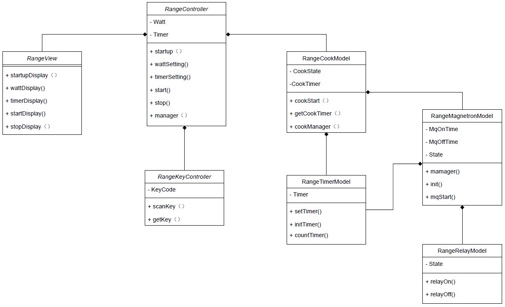

# C言語でオブジェクト指向を実現する

## はじめに
    ソースコードを機能単位にモジュール分割し、低結合で高凝集なプログラムを組むことを達成するために
    C言語でオブジェクト指向的にプログラムを設計する事を目標とする。
<br>

## オブジェクト指向でプログラミングする事のメリット
    オブジェクト指向でプログラミングを行う事で以下のようなメリットがあると考える。
    ・クラス単位でモジュール化して実装することができる。
        →モジュール間の結合度が下がることにより、プログラムの修正や変更が容易になる。
        →単体テストツールでのテストを適用し易くなり、テスト駆動開発などのテストファーストな設計手法を導入し易くなる。
        →モジュール間の結合度が低いため、多人数での分担実装が容易になる。
    ・UMLに従ってモデリングできる。
        →プログラム全体を俯瞰して図示できるため、プログラム設計やコードの理解が容易になる。
<br>

## できること、できないこと
    C言語でオブジェクト指向プログラムをどこまで実現するか、出来ることと出来ないことを始めに決める。

### 出来ること
    ・クラス単位でのモジュール化        ：構造体を用いてクラスを表現する。
    ・クラスに属性と操作を持たせる      ：関数ポインタを用いて構造体に操作を実装する。
    ・クラスの集約（集化、has-aの関係） ：クラスメンバに別のクラスを取り込む。
    ・多態性                          ：クラス操作(関数ポインタ)に任意の関数を渡すことで実現する。

### 出来ないこと
    ・クラスの継承（is-aの関係）        ：工夫をすればC言語でも継承を実現できるが、プログラムが複雑になるため継承は行わない。
    ・カプセル化                       ：C言語仕様上カプセル化は実装できないので諦める。
<br>


## クラスの実装方法
### クラスの定義
    クラスは構造体（struct）を用いて定義する。
    クラスは以下の3種類のメンバーを持つことができる。
    ・属性（フィールド）：クラスが所有する変数
    ・操作（メソッド）  ：クラスが所有する関数
    ・集約             ：他クラスを集約することができる

### クラスとメソッドの宣言、及びクラスの定義の例
```c
// まずはクラス型をtypedef宣言する
typedef _sampleClass sampleClass_t;

// メソッドを宣言する
typedef void (*method)(sampleClass_t *this, int a);

// クラスを定義する
struct _sampleClass {
    // 属性
    int field;
    // 操作
    method pMethod;
    // 集約
    anotherClass_t anotherClass;
};
```

### メソッドの定義
    メソッドはまず関数ポインタを宣言し、そのポインタ変数をクラスに格納することで実現する。
    自身が格納されるクラスのポインタをメソッドの第一引数に指定する。

### 集約
    クラスは別のクラスを所有することができる。オブジェクト指向の集約の関係。
    集約は、クラス構造体の中に別のクラス構造体を内包することで実現する。

### デバイスの集約
    IIC、リレー（I/O）など、システムの中にただ一つしかないオブジェクトをクラス構造体に集約すると、
    オブジェクトを複数インスタンス化したときに、該当デバイスのインスタンスが複数実体化される可能性がある。
    よって、デバイスのオブジェクトはクラス構造体に集約せず、上位クラスのファイルの中にグローバル変数で宣言する。
    こうすることで、オブジェクトを複数インスタンス化しても、デバイスのインスタンスはシステム内でただ一つの存在にできる。

### クラスの実装
    以下の様に、まずはメソッドの実体を宣言＆定義する。
    次にクラスの初期値を変数として定義し、属性と操作をコンストラクタ関数で関数ポインタに関連づける。
```c
// メソッドの実体を宣言
static void method (sampleClass_t *this, int a);

// クラスの初期値を定義
const sampleClass_t sampleClassInitValue = {
    0,
    &method
};

// メソッドの実体を定義
static void method (sampleClass_t *this, int a)
{
    printf ("field = %d\n", this->field);
}

// コンストラクタで初期化
void sampleClass_Constructor (sampleClass_t *this)
{
    this->field = sampleClassInitValue.field;
    this->pMethod = sampleClassInitValue.pMethod;
}
```
### インスタンスの生成と初期化
    以下のようにインスタンスを生成し、コンストラクタを呼び出して初期化する。
```c
sampleClass_t sampleClass;                  // 生成
sampleClass_Constructor (&sampleClass);     // 初期化
```

### メソッドの呼び出し
    別クラスなどから、以下のようにして呼び出す。
    第一引数には自身のクラスのポインタを渡す。
```c
sampleClass->method (&sampleClass, 1);
```
<br>

## ファイル構成
### ファイルの種類
    クラスは、2つのヘッダファイルと1つのcソースファイルから構成される。
    「クラス構造体の定義」と「クラス構造体（及びその他変数）の宣言」をそれぞれ別のヘッダファイルに記載する。
    これは、クラス構造体（及びその他変数）を別ファイルから参照のみ行いたい場合に、
    ファイルの相互参照が発生しコンパイルエラーとなるのを防ぐためである。

    ・sampleClass.h ：クラス構造体の定義と、コンストラクタ関数の宣言を記述する。
    ・sample.h      ：クラス構造体とメソッドの関数ポインタの宣言を記述する。
                    　その他、列挙型や#define等も記述する。
    ・sample.c      ：クラスの本体を記述する。

### インクルード
    以下の順序でヘッダファイルをインクルードする。
    ① ：sampleClass.hはsample.hをインクルードする。
    ② ：sample.cはsampleClass.hをインクルードする。
    ③ ：別クラスを集約する場合は、sampleClass.hにanotherClass.hをインクルードする。
    ④ ：列挙型やメソッドのみ別クラスで参照したい場合は、sample.hをインクルードする。

<br>


## 多態性
### 多態性の実現
    クラス操作(関数ポインタ)に外部から任意の関数を渡すことで、オブジェクト指向の多態性っぽいものを実現できる。
    例えば、処理の非常に似通った別モジュール（UART1とUART2など）の処理を共通の一つのクラスにして、
    呼び出すAPIだけを外部から与えてやることで、「処理内容は同じだが別々のポートが動作する」ということを実現できる。

### 実現方法
    1. まず、メソッドとクラスメンバの初期値(sampleClassInitValue)を2つ以上宣言する。
    2. sampleClassInitValueをヘッダファイルにextern宣言する。
    3. コンストラクタの引数でsampleClassInitValueを受け取るように変更する。
    4. インスタンスの初期化時にsampleClassInitValueをコンストラクタに渡してやる。

```c : sample.c
/* sample.c */
// メソッドを2つ定義する
static void method1 (sampleClass_t *this, int a)
{
    printf ("value = %d\n", (this->field + a));
}

static void method2 (sampleClass_t *this, int a)
{
    printf ("value = %d\n", (this->field * a));
}

// クラスの初期値を2つ定義する
// それぞれ異なるフィールドとメソッドを初期値に指定しておく
const sampleClass_t sampleClassInitValue1 = {
    1,
    &method1
};

const sampleClass_t sampleClassInitValue2 = {
    2,
    &method2
};

// 初期値を引数で受け取るように変更する
void sampleClass_Constructor (sampleClass_t *this, sampleClass_t initValue)
{
    this->field = initValue.field;
    this->pMethod = initValue.pMethod;
}
```

```c : sampleClass.h
/* sampleClass.h */
// 初期値をextern宣言する
extern const sampleClass_t sampleClassInitValue1;
extern const sampleClass_t sampleClassInitValue2;
```

```c : another.c
/* another.c */
// インスタンスの初期化時に異なる初期値を与える
sampleClass_t instance1, instance2;
sampleClass_Constructor (&instance1, sampleClassInitValue1);
sampleClass_Constructor (&instance2, sampleClassInitValue2);

// メソッドを実行する
instance1->pMethod (&instance1, 2);
instance2->pMethod (&instance2, 2);
```
実行結果
```shell
value = 3
value = 4
```
<br>

## MVCモデル
### MVCモデルとは
    MVCモデルとは、システムを役割ごとにModel, View, Controllerに分割してコーディングを行うモデルである。
    組み込み開発いおいてもMVCモデルで実装することができる。
    MVCモデルで実装することによって、機能ごとに分割された独立性の高い設計とすることができる。
    
    ・Model ：システムの中でシステムロジックを担当する部分。
    ・View  ：表示を担当する部分。
    ・Controller：ユーザーの入力に基づき、ModelとViewを制御する部分。    

### 組み込み機器での例
    組み込み機器でのMVCモデルの例として、電子レンジを例にしたモデルを示す。
    電子レンジでは下記のようになる。

    ・Model ：調理の制御を行う部分。
                調理状態遷移、調理タイマ制御、マグネトロン制御、リレー制御など。
    ・View  ：表示に関する部分。
                調理出力設定の表示、調理時間の表示など。
    ・Controller：ユーザーからの入力や、調理に関する設定を行う部分。
                キー入力、調理出力の設定、調理時間の設定、調理開始の指示など。
 
<br>


## 参考図書、参考サイト
参考図書：<br>
- モダンC言語プログラミング（ASCII DWANGO）
- C言語によるオブジェクト指向プログラミング入門（翔泳社）

参考サイト：<br>
- [初心者向けに徹底解説！オブジェクト指向とは？](https://eng-entrance.com/what-oop)<br>
- [オブジェクト指向によるクラス設計](https://thinkit.co.jp/article/13112)<br>
- [MVCモデルについて](https://qiita.com/s_emoto/items/975cc38a3e0de462966a)
